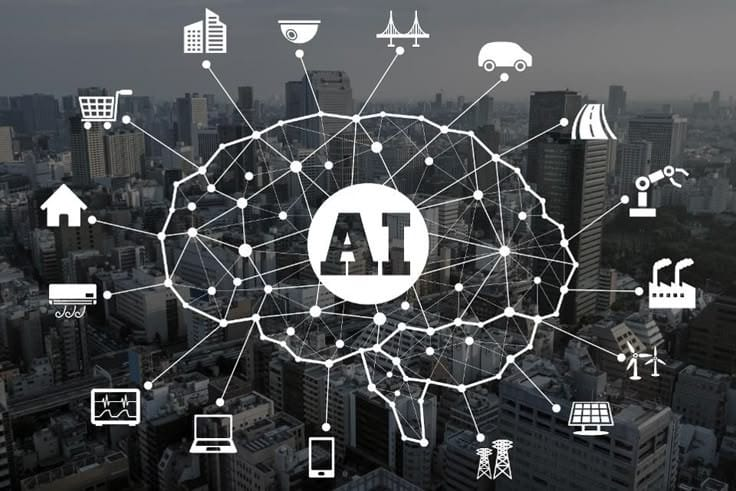

# 📚 Learning Roadmap: Python → Data Analysis → AI → ML → Deep Learning

## Description / Overview

This roadmap is designed to take learners from **basic Python programming** to **Data Analysis, Artificial Intelligence, Machine Learning, and Deep Learning**. Each week focuses on a specific topic, with clear tasks and practical exercises to consolidate learning. All resources are linked for easy access.

- **Python Weeks 1–2:** Build foundational programming skills, learn data structures, loops, functions, and basic syntax.  
- **NumPy & Pandas Weeks 3–6:** Learn numerical computing, data manipulation, and visualization with Python libraries. Includes hands-on projects.  
- **AI Weeks 7–8:** Introduction to AI concepts, responsible AI, supervised and unsupervised learning, and universal ML process.  
- **Machine Learning Weeks 1–8:** Structured ML learning with theory, practical exercises, and assignments covering supervised, unsupervised, and meta algorithms.  
- **Deep Learning Weeks 1–12:** Learn neural networks, CNNs, RNNs, LSTMs, GRUs, word embeddings, and complete final projects with practical datasets.
  

---

## 📅 Week 1 – Python Basics

| Week | Topics | Tasks | Link |
|------|--------|-------|------|
| 1 | - General Syntax, Hello World, Comments    - Data Types, Variables, Math Operators    - Strings, Print & Input    - Control Flow & Branching (If Statements, Logic Ops)    - Loops (While, For, For with Strings, Bisection Search)    - Functions + Variable Scope | - ✅ Complete the related part of the course   - ✅ Write programs:   1. Define variables of different types and print their types.   2. A program that checks if a number is even or odd.   3. Print numbers from 1–100 using while.   4. A function that calculates the square of any number entered by the user. | [🔗 Maharatech – Python Basics](https://maharatech.gov.eg/course/view.php?id=43) |

---

## 📅 Week 2 – Python Collections

| Week | Topics | Tasks | Link |
|------|--------|-------|------|
| 2 | - Tuples + Tuple Features    - Lists + Operations on Lists    - Lists in Memory (Aliasing vs Cloning) + Mutation & Iteration    - Dictionaries + More Operations on Dictionaries | - ✅ Complete the related part of the course   - ✅ Write programs:   1. Create a tuple with 5 friends' names and print them.   2. Create a list with students' grades and print the average.   3. Try Aliasing vs Cloning with a list and modify one.   4. Create a dictionary with students' names and grades, then print the highest grade. | [🔗 Maharatech – Python Collections](https://maharatech.gov.eg/course/view.php?id=43) |

---

## 📅 Week 3 – NumPy Basics

| Week | Topics | Tasks | Links |
|------|--------|-------|-------|
| 3 | - Introduction to NumPy   - Random   - Arange   - Reshape, Min, Max, Sum   - Math Operations   - Slicing   - Select Items | - ✅ Complete the related video lectures   - ✅ Write programs:   1. Create an array of numbers from 1–10 and print it.   2. Use random to create a 3×3 array of random numbers.   3. Create an array using arange from 0–20 with step 2.   4. Apply reshape to convert an array into 2×5.   5. Calculate min, max, and sum of an array.   6. Perform addition and subtraction between two arrays.   7. Use slicing on a 2D array and select specific elements. | [NumPy 01 – Intro](https://youtu.be/kaJI14pJqCw?si=fFXvBPwK_FXaTLcr)   [NumPy 02 – Random](https://youtu.be/N-HJJuQd9v4?si=RStSZlGr5aHCGmgj)   [NumPy 03 – Arange](https://youtu.be/7QO7TjWbv7A?si=XYnZcJeDgpwDYzsE)   [NumPy 04 – Reshape & Min/Max/Sum](https://youtu.be/dhm1UGhWbYk?si=z5BUVYwP9qy20z-6)   [NumPy 05 – Math Operations](https://youtu.be/PIbIh3myWZ0?si=nydB5V8siwHERVFa)   [NumPy 06 – Slicing](https://youtu.be/9fBexTpLkis?si=_dr9yMcGRAWdUG7r)   [NumPy 07 – Select Items](https://youtu.be/qWZU63an0zQ?si=my6ANfSjXaUXuIc_) |

---

## 📅 Week 4 – Pandas Basics

| Week | Topics | Tasks | Links |
|------|--------|-------|-------|
| 4 | - DataFrame & Series   - Getting Data from CSV & Excel   - Data Exploration   - Data Cleaning (1 + 2)   - Apply Function   - Tables Merge   - GroupBy | - ✅ Complete the related video lectures   - ✅ Write programs:   1. Create a Series with numbers from 10–20.   2. Create a DataFrame with students’ names and grades.   3. Read a simple CSV file (e.g., student data).   4. Use describe() + info() on a DataFrame.   5. Clean a DataFrame with missing values (NaN).   6. Perform a merge between two tables (students + grades).   7. Use GroupBy to calculate the average student grades. | [Pandas 01 – DataFrame & Series](https://youtu.be/-unr9sGwhKQ?si=7ntW_d4aUwVsPNXb)   [Pandas 02 – CSV & Excel](https://youtu.be/FiHcS5OYLRA?si=9zQNiHHV_PPlUmUf)   [Pandas 03 – Data Exploration](https://youtu.be/O-5zezuQ4i0?si=VHujCcYMm7D5F8F6)   [Pandas 04 – Data Cleaning 1](https://youtu.be/K3ZTSAeoOz4?si=japCPPcwCVM92Czb)   [Pandas 05 – Data Cleaning 2](https://youtu.be/6W68YF5_8lM?si=0BXsS-oiIuAZRSH7)   [Pandas 06 – Apply Function](https://youtu.be/vno-3H-Ab-Q?si=6qTaDgXC8rVrfh7V)   [Pandas 07 – Merge & GroupBy](https://youtu.be/4hUogf4N2mQ?si=D8f3oZr1Wze8rKsy) |

---

## 📅 Week 5 – Data Analysis & Visualization with Python

| Week | Topics | Tasks | Links |
|------|--------|-------|-------|
| 5 | - Introduction to Data Analysis with Python   - Data Analysis (loc, apply, np.where, to_csv, to_excel)   - value_counts, groupby, pivot_table   - Visualization by Python (plot)   - Matplotlib Basics   - Seaborn Basics | ✅ Complete the related parts of the videos.    ✅ Write programs:   1. Import a dataset (e.g., a simple CSV for students).   2. Try loc, apply, and np.where on columns.   3. Save a new version of the dataset with to_csv and to_excel.   4. Use value_counts to calculate frequency of values.   5. Apply groupby and pivot_table to find mean/sum of columns.   6. Create visualizations using Pandas plot.   7. Try Matplotlib: line, bar, pie charts.   8. Try Seaborn: scatterplot, barplot, heatmap. | [Intro](https://youtu.be/AwJgraHmm4g?si=9hBQGwqOe2Wh2vea)   [Data Analysis – loc/apply/np.where/to_csv/to_excel](https://youtu.be/yMjCTzeXxhw?si=RTfuSq86_HGahJcn)   [value_counts / groupby / pivot_table](https://youtu.be/rS5STs8THsc?si=62Ax2jp6YnD1-YQR)   [Visualization by Python – plot](https://youtu.be/0GHSXwPHV6U?si=bDEuzjanEd8uaziE)   [Matplotlib Basics](https://youtu.be/gElp7fy9Nk4?si=MXlA0wsEmacDW5nC)   [Seaborn Basics](https://youtu.be/RwO5bXF1-xY?si=c-Ar4Gep45mVBmCt) |

---

## 📅 Week 6 – Comprehensive Data Analysis Project

| Week | Topics | Tasks | Links |
|------|--------|-------|-------|
| 6 | - Comprehensive Project covering:   • Python Basics (Variables, Functions, Loops)   • NumPy (Arrays, Operations)   • Pandas (DataFrame, Cleaning, GroupBy, Merge)   • Visualization (Matplotlib & Seaborn) | ✅ Follow the project steps from the videos.    ✅ Tasks:   1. Import dataset and clean the data.   2. Analyze data using Pandas (groupby, pivot, apply).   3. Perform calculations using NumPy.   4. Create visualizations for the results (Matplotlib + Seaborn).   5. Write a short report in Jupyter Notebook showing analysis steps with screenshots. | 🔗 [Project Playlist – Data Analysis with Python](https://youtube.com/playlist?list=PLaKH4x6WxzvLRDWdyrsw5CtKTwALq-) |

---

## 📅 Week 7 – Introduction to AI

| Week | Topics | Tasks | Links |
|------|--------|-------|-------|
| 7 | - Module 01: What is AI?   - Module 02: AI is not magic, it is just Maths   - Module 03: Uses of AI   - Module 04: Responsible AI   - Module 05: AI, Jobs and Me | ✅ Complete all modules (01 → 05)   ✅ Solve the MCQ for each module   ✅ Submit the final certificate | 🔗 [MaharaTech – AI Course](https://maharatech.gov.eg/course/view.php?id=1619) |

---

# 📘 Machine Learning Roadmap

A structured study plan for Machine Learning courses with weekly topics, tasks, and links.

---

| Week | Topics | Tasks | Links |
|------|--------|-------|-------|
| 1 | CH01 – Introduction to AI   - What is AI?   - Working in an AI team   - AI Society   - How AI works? | ✅ Watch CH01 videos   ✅ Solve MCQ questions for CH01 | 🔗 [MaharaTech – Full Course](https://maharatech.gov.eg/course/view.php?id=2139) |
| 2 | CH02 – Supervised Learning (Part 1)   - Intro & Roadmap   - Models anatomy   - SL ingredients   - Keras program MNIST   - Problem types & Design Pattern   - Losses and output layer | ✅ Solve MCQ for Part 1 | 🔗 [MaharaTech – Full Course](https://maharatech.gov.eg/course/view.php?id=2139) |
| 3 | CH02 – Supervised Learning (Part 2)   - Sklearn Optional   - Optimizer intro   - Normal equation + Linear regression   - Logistic Regression   - SVM | ✅ Solve MCQ for Part 2 | 🔗 [MaharaTech – Full Course](https://maharatech.gov.eg/course/view.php?id=2139) |
| 4 | CH02 – Supervised Learning (Part 3)   - Non-linear models   - Deep Neural Networks (DNN)   - Overfitting vs. Underfitting   - Regularization   - Summary | ✅ Solve MCQ for Part 3 | 🔗 [MaharaTech – Full Course](https://maharatech.gov.eg/course/view.php?id=2139) |
| 5 | CH03 – Universal ML Process   - Terminologies & Process overview   - Defining problem & Data assembly   - Loss vs Metric   - Decision Boundaries   - Precision / Recall / F1   - Class imbalance & solutions   - Model selection | ✅ Solve MCQ for CH03 | 🔗 [MaharaTech – Full Course](https://maharatech.gov.eg/course/view.php?id=2139) |
| 6 | CH04 – ML Meta Algorithms   - Model selection revisited   - Bootstrapping   - Voting & Ensembles   - Bagging   - Decision Trees   - Random Forests   - Boosting   - Wrap up | ✅ Solve MCQ for CH04 | 🔗 [MaharaTech – Full Course](https://maharatech.gov.eg/course/view.php?id=2139) |
| 7 | CH05 – Unsupervised Learning (Part 1)   - Intro & Roadmap   - Unsupervised Learning revisited   - Dimensionality Reduction (Intro + Types + PCA) | ✅ Solve MCQ for Part 1 | 🔗 [MaharaTech – Full Course](https://maharatech.gov.eg/course/view.php?id=2139) |
| 8 | CH05 – Unsupervised Learning (Part 2)   - Clustering (Hard/Soft)   - K-Means   - Semi-supervised learning   - Course Summary | ✅ Solve final MCQ   ✅ Submit final certificate | 🔗 [MaharaTech – Full Course](https://maharatech.gov.eg/course/view.php?id=2139) |

---

## 📅 Deep Learning Roadmap

| Week | Topics | Tasks | Links |
|------|--------|-------|-------|
| 1 | CH01 – Essential Libraries for Deep Learning   - NumPy (1D, 2D Arrays, Indexing, Operations)   - Matplotlib Basics   - SciPy for Image Processing   - TensorFlow Intro | ✅ Solve MCQ questions   ✅ Try the provided code examples | 🔗 [MaharaTech – Full Course](https://maharatech.gov.eg/course/view.php?id=738) |
| 2 | CH02 – Building & Training Your First Neural Network   - Fashion MNIST Dataset   - Implementing DNN with Keras   - Performance Improvement | ✅ Apply NN on Colab   ✅ Solve MCQ | 🔗 [MaharaTech – Full Course](https://maharatech.gov.eg/course/view.php?id=738) |
| 3 | CH03 – Implementing More Complex Neural Network for Image Classification   - Data Preparation   - CNN Visualization   - Training & Testing   - Saving & Restoring Models | ✅ Submit Assignment (CH03 code file)   ✅ Solve MCQ | 🔗 [MaharaTech – Full Course](https://maharatech.gov.eg/course/view.php?id=738) |
| 4 | CH04 – Hyperparameter Tuning using Grid Search   - Batch Size & Epochs   - Optimizers   - Activation Functions   - Dropout   - Learning Rate & Momentum | ✅ Try Grid Search   ✅ Submit Assignment (CH04)   ✅ Solve MCQ | 🔗 [MaharaTech – Full Course](https://maharatech.gov.eg/course/view.php?id=738) |
| 5 | CH05 – 5 CNN Architectures   - LeNet-5   - AlexNet   - VGG   - Inception   - ResNet   - Apply VGG16 | ✅ Try applying VGG16   ✅ Solve MCQ | 🔗 [MaharaTech – Full Course](https://maharatech.gov.eg/course/view.php?id=738) |
| 6 | CH06 – Recurrent Neural Network (Theory)   - Vanilla RNN   - BPTT   - Training Challenges   - LSTM   - GRU | ✅ Solve MCQ | 🔗 [MaharaTech – Full Course](https://maharatech.gov.eg/course/view.php?id=738) |
| 7 | CH07 – Project 01: Text Classification   - BBC News Dataset   - Data Cleaning   - Build & Train RNN   - Plot History | ✅ Complete the project   ✅ Submit code   ✅ Solve MCQ | 🔗 [MaharaTech – Full Course](https://maharatech.gov.eg/course/view.php?id=738) |
| 8 | CH08 – Project 02: Machine Translation   - English–French Dataset   - Data Preprocessing   - Build & Train Model | ✅ Complete the project   ✅ Submit code   ✅ Solve MCQ | 🔗 [MaharaTech – Full Course](https://maharatech.gov.eg/course/view.php?id=738) |
| 9 | CH09 – Project 03: Time Series Prediction   - Data Cleaning   - Build & Train LSTM   - Regression with LSTM | ✅ Complete the project   ✅ Submit code   ✅ Solve MCQ | 🔗 [MaharaTech – Full Course](https://maharatech.gov.eg/course/view.php?id=738) |
| 10 | CH10 – Project 04: GRU with IMDb   - IMDb Dataset   - Build & Train GRU Model | ✅ Complete the project   ✅ Submit code   ✅ Solve MCQ | 🔗 [MaharaTech – Full Course](https://maharatech.gov.eg/course/view.php?id=738) |
| 11 | CH11 – Project 05: Word Embeddings   - Represent Text Data with Word Embeddings | ✅ Complete the project   ✅ Submit code   ✅ Solve MCQ | 🔗 [MaharaTech – Full Course](https://maharatech.gov.eg/course/view.php?id=738) |
| 12 | CH12 – Final Project: Sentiment Analysis   - IMDb Dataset   - Data Cleaning & Preprocessing   - Build & Train RNN Model | ✅ Complete final project   ✅ Submit project   ✅ Get certificate | 🔗 [MaharaTech – Full Course](https://maharatech.gov.eg/course/view.php?id=738) |

---

Notes

✅ Tasks include completing video lectures, solving MCQs, writing programs, and submitting assignments/projects.

🔗 All links point to free online resources from MaharaTech and YouTube.

This roadmap is self-paced; learners can adjust timing according to availability.

---

Author

Created by: Ahmed Osama & Ahmed Hassan & Mahmoud Badr

Purpose: Structured and practical roadmap for learners to master Python, Data Analysis, AI, ML, and Deep Learning.

